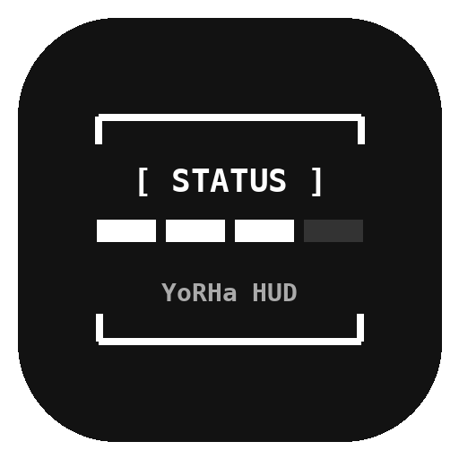

 

<h1 align="center">YoRHa HUD</h1>

  A minimal, dynamic system monitor for KDE Plasma 6.

## Plasmoid view in full rice:

##  Current Status
Most of the HUD text is currently **decorative** in nature to maintain NieR's tactical aesthetic.

**Currently, real-time telemetry is implemented for:**
* `CPU_LOAD`
* `RAM_USE`
* `GPU_LOAD`
* `BATTERY / VRAM_USED`

##  Future Plans
The goal is to replace all decorative elements with functional system information while maintaining NieR's aesthetic.

# Installation

Currently, the widget is installed manually:
1. Download the com.axzoros.yorhahud.tar.gz from the [Latest Release](https://github.com/AxZoRos/YoRHa-HUD/releases/latest)
2. Download the plasmoid either through edit mode or with the following command in the terminal:
<pre>
kpackagetool6 --type Plasma/Applet --install com.axzoros.yorhahud.tar.gz
</pre>
